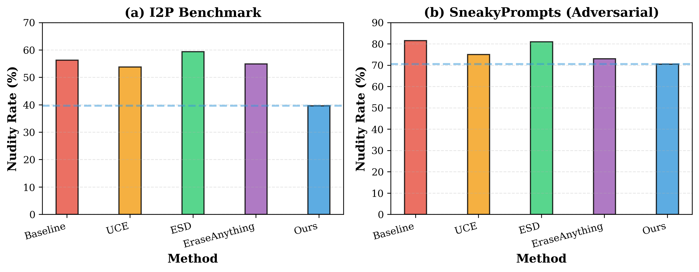
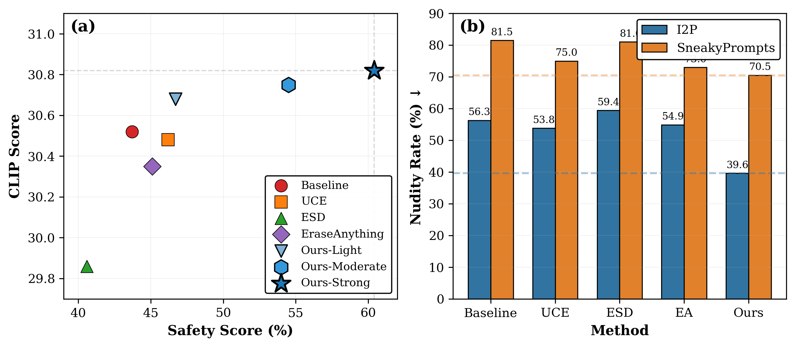
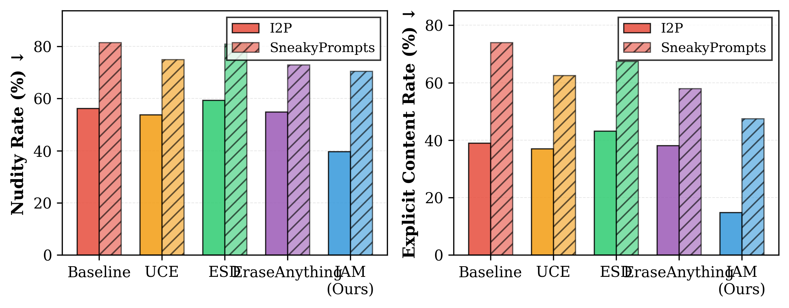

<div align="center">

# Introspective Attention Modulation for Safe Text-to-Image Generation

<a href="https://findanexpert.unimelb.edu.au/profile/1065421-basim-azam">Basim Azam</a><sup>1</sup> ·
<a href="https://www.lancaster.ac.uk/scc/about-us/people/hossein-rahmani">Hossein Rahmani</a><sup>2</sup> ·
<a href="https://findanexpert.unimelb.edu.au/profile/1050019-naveed-akhtar">Naveed Akhtar</a><sup>1</sup>

<sup>1</sup>The University of Melbourne &nbsp;·&nbsp; <sup>2</sup>Lancaster University

### ECCV 2026

[](https://arxiv.org/abs/XXXX.XXXXX)
[](https://eccv.ecva.net/)
[](https://basim-azam.github.io/iam)
[](LICENSE)



</div>

> ⚠️ **Content warning.** This research studies unsafe (sexual, violent, disturbing) content produced by text-to-image models. Any unsafe examples shown in our materials are concealed.

---

## 📰 News

- **2026-06** — Paper accepted to **ECCV 2026**. 🎉 The [project page](https://basim-azam.github.io/iam) is live.
- **Code & models are coming soon** — see the release checklist below.

## 🗓️ Release

- [x] Project page
- [x] Paper / arXiv
- [ ] Inference code
- [ ] Learned safety direction (`w_unsafe`)
- [ ] Evaluation & training code

## ✨ Overview

**IAM** is a **training-free, inference-time** safety control for flow-based diffusion transformers (FLUX). Rather than editing model weights — which adapters such as LoRA can simply undo — IAM lets the model **introspect its own attention** during denoising and **steers it away from unsafe concepts**, preserving semantic alignment and image quality with **no retraining** of the base model. An introspection-ratio handle (Light / Moderate / Strong) provides a continuous safety–quality trade-off.

## 📊 Results

<div align="center">

<br><em>Safety–quality trade-off: IAM (Light → Strong) reaches the safe, high-fidelity corner,
dominating concept-erasure baselines (UCE, ESD, EraseAnything).</em>
<br><br>

<br><em>Across the standard I2P benchmark and the adversarial SneakyPrompts set, IAM attains the
lowest nudity and explicit-content rates among compared methods (lower is better).</em>
</div>

## 🛠️ Setup &amp; Usage

> ⏳ Releasing with the code. The intended interface:

```python
from iam import load_pipeline, generate, PRESETS

pipe, procs = load_pipeline()                                  # FLUX.1-dev (+ optional adapter)
img = generate(pipe, procs, "a portrait in a garden", PRESETS["strong"], seed=42)
img.save("iam_output.png")
```

## 📌 Citation

```bibtex
@inproceedings{azam2026iam,
  title     = {Introspective Attention Modulation for Safe Text-to-Image Generation},
  author    = {Azam, Basim and Rahmani, Hossein and Akhtar, Naveed},
  booktitle = {Proceedings of the European Conference on Computer Vision (ECCV)},
  year      = {2026}
}
```

## 🙏 Acknowledgements

Naveed Akhtar is a recipient of the Australian Research Council Discovery Early Career Researcher Award (project #DE230101058) funded by the Australian Government. This research was supported by The University of Melbourne's Research Computing Services and the Petascale Campus Initiative.
